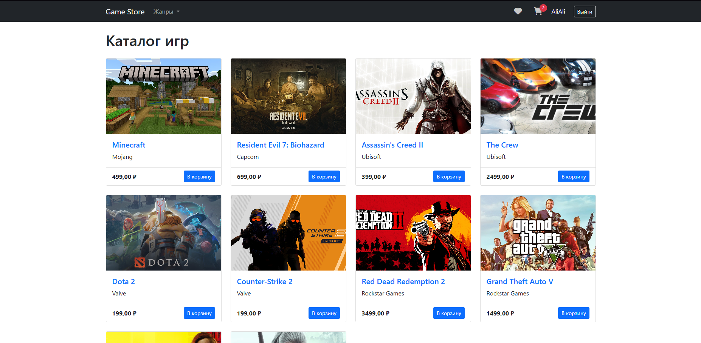
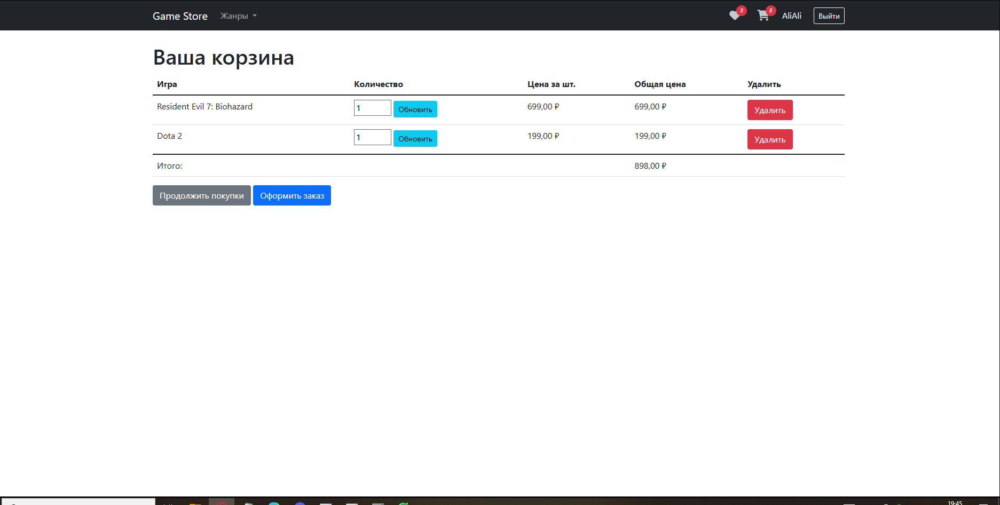
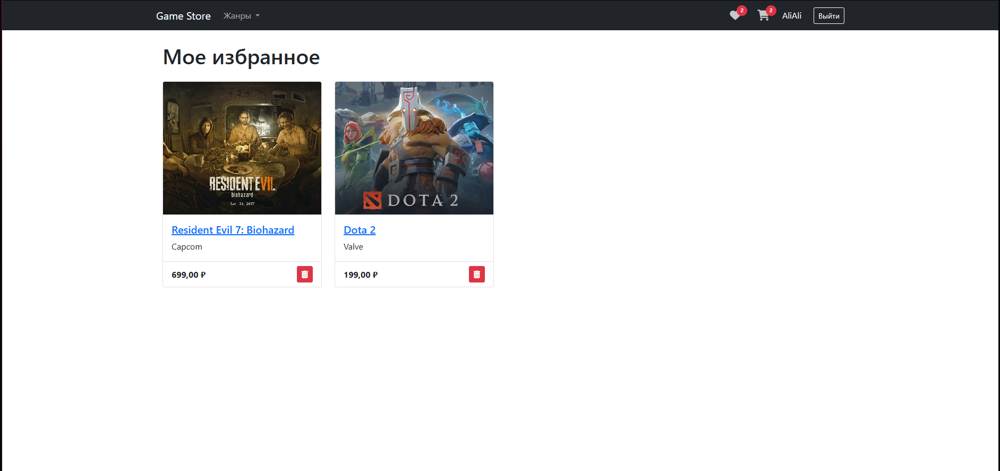
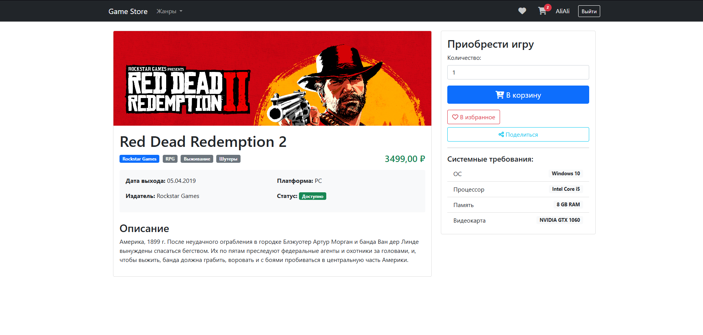
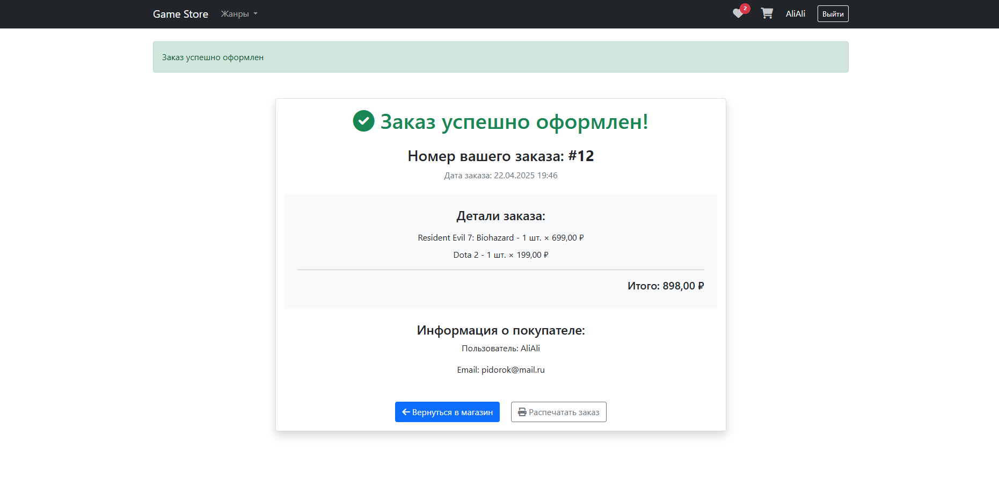

# 🎮 GameStore — Интернет-магазин видеоигр

[](https://www.djangoproject.com/)
[](https://getbootstrap.com/)
[](LICENSE)

**Онлайн-магазин для продажи игр с корзиной, аутентификацией и админ-панелью.**  
[Демо проекта](https://github.com/MrUlkiNov/GameStore.git) | [Исходный код](https://github.com/MrUlkiNov/GameStore.git)

---

## ✨ Особенности
- 🕹️ Каталог игр с фильтрацией по жанрам и ценам
- 🛒 Сессионная корзина покупок
- 🔐 Регистрация/авторизация пользователей
- 📦 Удобная админ-панель Django
- 📱 Адаптивный интерфейс (Bootstrap 5)
- 🖼️ Загрузка изображений для игр

---

## 🛠 Технологии
| Категория       | Стек                          |
|-----------------|-------------------------------|
| **Backend**     | Django 5.1.7                  |
| **Frontend**    | HTML, Bootstrap 5, Crispy Forms |
| **База данных** | SQLite                        |
| **Дополнительно**| Pillow, python-dotenv       |

---

## 🚀 Быстрый старт

### 1. Клонирование репозитория
```bash
git clone https://github.com/MrUlkiNov/GameStore.git
cd GameStore
```
###2. Настройка виртуального окружения
```bash
python -m venv venv
# Активация:
# Windows:
venv\Scripts\activate
# Linux/Mac:
source venv/bin/activate
```
### 3. Установка зависимостей
```bash
pip install -r requirements.txt
```

### 4. Создание .env файла
```bash
SECRET_KEY=ваш_секретный_ключ
DEBUG=True
ALLOWED_HOSTS=localhost,127.0.0.1
```
### 5. Применение миграций
```bash
python manage.py migrate
```
### 6. Создание суперпользователя
```bash
python manage.py createsuperuser
```

### 7. Запуск сервера
```bash
python manage.py runserver
```
Откройте в браузере: http://localhost:8000

---
## 📂 Структура проекта
GameStore/
|├── store/               # Основное приложение|
|│   ├── migrations/      # Миграции БД|
|│   ├── templates/       # HTML-шаблоны|
|│   ├── models.py        # Модели (игры, корзина, пользователи)|
|│   └── views.py         # Логика страниц|
|├── game_store/          # Настройки проекта|
|├── static/              # CSS, JS, изображения|
|├── media/               # Обложки игр|
|├── .gitignore           # Игнорируемые файлы|
|└── requirements.txt     # Зависимости|

---
## ⚙️ Конфигурация
Настройки Crispy Forms
```python
CRISPY_TEMPLATE_PACK = 'bootstrap5'
```
Доступ к медиафайлам
Убедитесь, что в urls.py добавлено:
```python
from django.conf import settings
from django.conf.urls.static import static

urlpatterns += static(settings.MEDIA_URL, document_root=settings.MEDIA_ROOT)
```

---

##📸 Скриншоты интерфейса
| Главная страница | Корзина | Избраное | Карточка | Оформление|
|------------------|---------|----------|----------|-----------|
|  |  |  |  |  |

---

##🔧 Возможные проблемы
Ошибка активации venv в PowerShell
```bash
Set-ExecutionPolicy RemoteSigned -Scope CurrentUser
```

Нет доступа к изображениям игр
Проверьте:

Наличие папки media/ в корне проекта.

Настройки в urls.py (см. раздел Конфигурация).

Ошибка "No module named 'crispy_forms'"
```bash
pip install django-crispy-forms==2.4
```
---

📄 Лицензия
Проект распространяется под лицензией MIT.
---

Автор: MrUlkiNov
📧 Email: sam.baybekov@mail.ru
🔗 GitHub: MrUlkiNov
